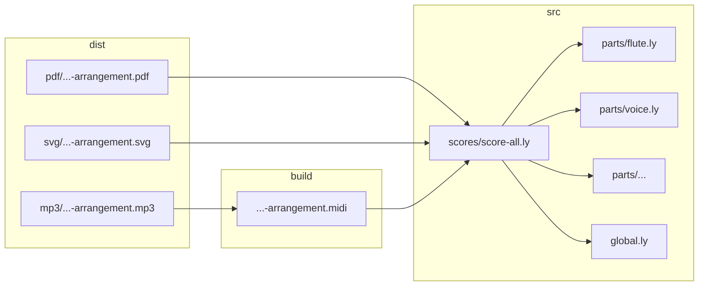

+++
date = '2026-10-06'
draft = true
title = 'Make-ing a musical arrangement'
+++

I’ve been playing around with [LilyPond](https://lilypond.org/): a programming language for creating sheet music. My latest creation, an arrangement of The Mountain by Gorillaz, has been the most ambitious. The result is a set of assets (PDFs, SVGs and MP3s) for the music piece as a whole, as well as for smaller pieces that focus on a single part or a subset of related parts. And while writing the LilyPond files was a challenge in and of itself, this post will focus on a tool that I knew existed for a long time, but never had used until now: `make`.

The `make` command reads instructions from a `Makefile` which describes the targets you want to conjure into existence, the dependencies that need to be conjured first and the commands that do the conjuring. For me this meant describing the PDFs, SVGs and MP3s I wanted to create, their dependencies on the LilyPond files and the commands to compile them. The `make` command-line tool reads the `Makefile`, constructs the dependency tree and executes the commands in the correct order. And most important, it only runs the commands if necessary: If a target already exists and was modified after its dependencies, then the target is assumed to be up to date and no command is run. It takes several minutes to `make` all assets of the musical arrangement from scratch. Using a `Makefile`, as opposed to a script that always creates everything from scratch, saved a lot of time.

The focus of my project was creating the sheet music, not the `Makefile`. So, most of the work put into the `Makefile` was outsourced to an LLM (Gemini) and as a result I ended the project with little understanding of how the `Makefile` actually works. This blogpost, therefore, is an attempt at making up for that lack of knowledge by forcing me to explain it to you. The full `Makefile` in question can be found [here](https://github.com/macabot/gorillaz-mountain/blob/main/Makefile). **TODO: point to a specific version**

First, let's start with an overview of the source files:

- `src/`
  - `diagrams/` (out of scope)
    - ...
  - `parts/`
    - `flute.ly`
    - `voice.ly`
    - ...
  - `scores/`
    - `score-all.ly`
    - `score-flute.ly`
    - `score-flute-voice.ly`
    - `score-voice.ly`
    - ...
  - `global.ly`

The LilyPond files in the `scores` directory depend on the LilyPond files in the `parts` directory, as well as on the `global.ly` file. I didn't know how to denote the dependencies between the .ly file. Instead of trying to extract `include` statements from the .ly files, I decided to incorporate the dependencies in the filenames. For example, looking at the filename `scores/score-flute-voice.ly`, you can see that, apart from `global.ly`, it depends on `parts/flute.ly` and `parts/voice.ly`. The `scores/score-all.ly` file is special, because it depends on **all** parts. The `diagrams` directory contains [Mermaid](https://mermaid.ai/open-source/) diagrams. To reduce the scope of this post, I will not discuss the process of converting these diagrams to SVGs.

Now, let’s look at the targets we want to create:

- `build/`
  - `macabot-gorillaz-mountain-arrangement.midi`
  - `macabot-gorillaz-mountain-dwarsfluit.midi`
  - `macabot-gorillaz-mountain-dwarsfluit-zang.midi`
  - `macabot-gorillaz-mountain-zang.midi`
  - ...
- `dist/`
  - `mp3/`
    - `macabot-gorillaz-mountain-arrangement.mp3`
    - `macabot-gorillaz-mountain-dwarsfluit.mp3`
    - `macabot-gorillaz-mountain-dwarsfluit-zang.mp3`
    - `macabot-gorillaz-mountain-zang.mp3`
    - ...
  - `pdf/`
    - `macabot-gorillaz-mountain-arrangement.pdf`
    - `macabot-gorillaz-mountain-dwarsfluit.pdf`
    - `macabot-gorillaz-mountain-dwarsfluit-zang.pdf`
    - `macabot-gorillaz-mountain-zang.pdf`
    - ...
  - `svg/`
    - `macabot-gorillaz-mountain-arrangement.svg`
    - `macabot-gorillaz-mountain-dwarsfluit.svg`
    - `macabot-gorillaz-mountain-dwarsfluit-zang.svg`
    - `macabot-gorillaz-mountain-zang.svg`
    - ...

First things first, what the heck are "dwarsfluit" and "zang"? No, you're not having a stroke. These words are Dutch. Since I posted the musical arrangement on my Dutch website ([macabot.nl/muziek/gorillaz-mountain/](https://www.macabot.nl/muziek/gorillaz-mountain/)), I wanted the filenames to be Dutch as well. The words "dwarsfluit" and "zang" are the Dutch replacements (not literal translations) of "flute" and "voice" in the source filenames. Also, I chose "arrangement" as the Dutch replacement for "all".

With that out of the way, let's take a look at the targets that need to be created. The PDF, SVG and MIDI files are created by compiling the .ly files in the `scores` directory. The MP3 files are created from the MIDI files. The flowchart below shows the dependencies of the PDF, SVG and MP3 on the full arrangement: `score-all.ly`. The `macabot-gorillaz-mountain` prefix has been left out for brevity:



The `score-all.ly` file depends on `global.ly` and on all the `parts/*.ly` files, the PDF, SVG and MIDI files depend on the `score-all.ly` file and the MP3 file depends on the MIDI file. There is actually another dependency: the PDF, SVG, MIDI and MP3 files also depend on the existence of the `build` and `dist` directories. The goal of the `Makefile` is to capture these dependencies and run the commands to create our targets, if necessary.

## Variables, functions and a macro

The `Makefile` starts by defining variables:

```make
# Directory Configuration
SRC_DIR   := src
SCORES_DIR:= $(SRC_DIR)/scores
PARTS_DIR := $(SRC_DIR)/parts
BUILD_DIR := build
DIST_DIR  := dist

DIST_PDF_DIR := $(DIST_DIR)/pdf
DIST_SVG_DIR := $(DIST_DIR)/svg
DIST_MP3_DIR := $(DIST_DIR)/mp3

# Output Naming Prefix
PREFIX := macabot-gorillaz-mountain
```

Note how a variable, such as `SRC_DIR`, is used to compose a new variable, such as `SCORES_DIR`, using the `$(...)` operator. Since `SRC_DIR` resolves to `src`, `$(SRC_DIR/scores` resolves to `src/scores`. This pattern will repeat itself throughout the `Makefile`.

Next, the `Makefile` defines "translations":

```make

# Translation Mapping (Single Words)
DUTCH_flute       := dwarsfluit
DUTCH_voice       := zang
DUTCH_all         := arrangement
# ...

ENG_dwarsfluit  := flute
ENG_zang        := voice
ENG_arrangement := all
# ...
```

As noted before, we want to replace the English part names (e.g. "flute") with their Dutch equivalent (e.g. "dwarsfluit"). So, why do we define translations in both directions? For example, why do we need both `DUTCH_flute` and `ENG_dwarsfluit`? Let's keep a list of questions we'd like answered by the end of the post.

<details open>
<summary>Questions:</summary>

- Why do we have translations in both directions?
</details>

Next, we encounter some functions
**TODO: remove comment above translate_word that belongs to to_dutch.**

```make
translate_word = $(or $(DUTCH_$(1)),$(1))
reverse_word   = $(or $(ENG_$(1)),$(1))
```

Let's zoom in on `translate_word`:

```make
translate_word = $(or $(DUTCH_$(1)),$(1))
```

`$(1)` corresponds to the first argument given to this function. So, if we call the `translate_word` function with the argument `flute`, then `$(1)` will resolve to `flute`, `DUTCH*$(1)` will resolve to `DUTCH_flute` and `$(DUTCH*flute)`will resolve to the value of the variable`DUTCH_flute`, which is `dwarsfluit`. The `$(or ...)` part evaluates its arguments from left to right and returns the first non-empty string. Here it functions as a fallback mechanism: if `$(DUTCH*$(1))` doesn't resolve to a value, then it returns the input argument `$(1)`.

The `reverse_word` function works the same as `translate_word`, except it takes a Dutch word and tries to find the corresponding English word. We still don't know why we need this function, but we'll find out once we answer the question on the list.

<details>
<summary>Questions:</summary>

- Why do we have translations in both directions?
</details>

Continuing in the Makefile, we see the following:
**TODO: place empty and space variable above to_dutch function.**

```make
empty :=
space := $(empty) $(empty)

to_dutch = $(subst $(space),-,$(strip $(foreach w,$(subst -, ,$(1)),$(call translate_word,$(w)))))
get_eng  = $(subst $(space),-,$(strip $(foreach w,$(subst -, ,$(1)),$(call reverse_word,$(w)))))
```

The thing that stands out is the `space` variable. Why do we define it in such a strange way? Why can't we define it as `space := " "`? Let's add the question to the list!

<details open>
<summary>Questions:</summary>

- Why do we have translations in both directions?
- Why can't we define `space` as `space := " "`?
</details>

Now let's address it immediately! The reason we don't write `space := " "` is because `make` treats quotes as literal characters. That is, if `space` were defined as `space := " "`, then the value would not be a single space character, but a string containing three characters: `"`, ` ` and `"`. We could define it with an actual space, but that hardly makes things better:

```make
empty :=
#       ^-- There is nothing here.
space :=
#        ^-- There's a space here, I swear!
```

To make things worse, editors often remove trailing spaces when saving a file. If so, `space` would silently become an empty string. `$(empty) $(empty)` is a safe workaround: `$(empty)` resolves to an empty string, leaving only the space in the middle. Question answered! Striking it from the list.

<details open>
<summary>Questions:</summary>

- Why do we have translations in both directions?
- ~Why can't we define `space` as `space := " "`?~
</details>

Now, what about the function

```make
to_dutch = $(subst $(space),-,$(strip $(foreach w,$(subst -, ,$(1)),$(call translate_word,$(w)))))
```

Let's unpack it into its components:
`$(subst`

- `$(space)`
- `-`
- `$(strip`
  - `$(foreach`
    - `w`
    - `$(subst`
      - `-`
      - ` `
      - `$(1)`
    - `$(call`
      - `translate_word`
      - `$(w)`

The `foreach` function takes 3 arguments: the variable containing the current item in the list, a list of items and the command to be executed for each item. So, in this case we can read it as: for every item `w` in the list `$(subst -, ,$(1))`, do `$(call translate_word,$(w))`. Here, `$(subst -, ,$(1))` substitutes every dash with a space in `$(1)` (the first argument given to `to_dutch`). Let's look at an example. Say we call `to_dutch` with the argument `flute-voice`. The `subst` function will replace the dash with a space (`flute voice`) and then the `foreach` will loop over the words. For each word, it will call the `translate_word` function, replacing `flute` with `dwarsfluit` and `voice` with `zang`. The `foreach` function returns a single string that is passed to `strip`. `strip` removes duplicate whitespace between words and strips whitespace from the very start and end of the string **footmark? strip not necessary?**. Finally, the outer `subst` function is used to change spaces back to dashes (`dwarsfluit-zang`). Note that here we use the `$(space)` variable. We could have used a literal space, but that would've been less legible:

```make
# Using $(space)
to_dutch = $(subst $(space),-,...)
# versus using a literal space
to_dutch = $(subst  ,-,...)
#                  ^--- There is a whitespace here!
```

To summarize: the `to_dutch` function splits the given argument by its dashes, translates the individual words and joins the translated words back together with dashes.

The `get_eng` function does effectively the same as the `to_dutch` function, but translates in the opposite direction. Though the question remains why we need it.

<details>
<summary>Questions:</summary>

- Why do we have translations in both directions?
- ~Why can't we define `space` as `space := " "`?~
</details>

**TODO: rename get_eng to to_eng**

There are a few more variable definitions to discuss, so bear with me.

```make
# Find score files
SCORES         := $(wildcard $(SCORES_DIR)/score-*.ly)
RAW_BASENAMES  := $(notdir $(basename $(SCORES)))
PART_NAMES     := $(patsubst score-%,%,$(RAW_BASENAMES))
```

The `wildcard` function is used to find all scores. Given `src/scores/score-*.ly`, it will search for all filenames in the `src/scores` directory that start with `score-` and end with `.ly`. The result is a space separated string of the matched paths: `src/scores/score-all.ly src/scores/score-flute.ly score-flute-voice.ly ...`.

The `basename` function strips extensions: `src/scores/score-all src/scores/score-flute score-flute-voice` `...`. This behaviour surprised me. I thought `basename` would strip the directory path, similar to how the `basename` command works in the terminal. The stripping of the directory path is instead done by the `notdir` function: `score-all score-flute score-flute-voice` `...`.

The `patsubst` does a search-replace (pattern substitution): for each raw basename, replace `score-%`, with `%`. That is, strip the `score-` prefix from every raw basename: `all flute flute-voice ...`.

Next

```make
# Target names with prefix
PREFIXED_BASENAMES := $(foreach p,$(PART_NAMES),$(PREFIX)-$(call to_dutch,$(p)))
```

Here we loop over the items in `PART_NAMES`: for each item, we add a prefix and call `to_dutch`: `macabot-gorillaz-mountain-arrangement macabot-gorillaz-mountain-dwarsfluit macabot-gorillaz-mountain-dwarsfluit-zang ...`.

The last variables:

```make
# Target Files
TARGET_PDFS := $(patsubst %, $(DIST_PDF_DIR)/%.pdf, $(PREFIXED_BASENAMES))
TARGET_SVGS := $(patsubst %, $(DIST_SVG_DIR)/%.svg, $(PREFIXED_BASENAMES))
TARGET_MP3S := $(patsubst %, $(DIST_MP3_DIR)/%.mp3, $(PREFIXED_BASENAMES))
```

Here we define the PDF, SVG and MP3 targets. The `patsubstr` function is used to add the directory path and file extension to each prefixed basename. The `TARGET_PDFS`, for example, takes each prefixed basename `%` and replaces it with `dist/pdf/%.pdf`: `dist/pdf/macabot-gorillaz-mountain-arrangement dist/pdf/macabot-gorillaz-mountain-dwarsfluit dist/pdf/macabot-gorillaz-mountain-dwarsfluit-zang ...`.

And finally, the last function:

```make
# Function: Parse dependencies dynamically
define get_deps
$(SRC_DIR)/global.ly \
$(if $(filter score-all score-arrangement,$(1)),\
    $(wildcard $(PARTS_DIR)/*.ly),\
    $(patsubst %,$(PARTS_DIR)/%.ly,$(subst -, ,$(patsubst score-%,%,$(1))))\
)
endef
```

Technically, `get_deps` is a macro, but from what I understand, a macro is just a multi-line function between the `define` and `endef` keywords. Let's break it down. The `get_deps` macro is used to get the .ly dependencies of a LilyPond score. The first line, `$(SRC_DIR)/global.ly`, is always returned, because every score depends on `global.ly`. Next, an if-statement that can be read as: if the score passed to `get_deps` is "score-all" or "score-arrangement", then return the paths to all .ly-files in the parts directory. **TODO: why check score-arrangement?** Else, return the parts equal to those in the score filename. To better understand the else-case, let's look at an example:

- `$(1)` -> `score-flute-voice`
- `$(patsubst score-%,%,score-flute-voice)` -> `flute-voice`
- `$(subst -, ,flute-voice)` -> `flute voice`
- `$(patsubst %,src/parts/%.ly,flute voice)` -> `src/parts/flute.ly src/parts/voice.ly`

There, we did it! After several variables, a couple of functions and one macro, we're ready to build the targets based on their dependencies.

## Building targets

We're more than halfway through the `Makefile` and can finally start defining the targets.

A target typically looks something like this:

```make
target_name: dependency_1 dependency_2 ...
command_1
command_2
...
```

An important detail: the commands must be indented with a tab character.

Let's look at the first targets in our `Makefile`:

```make
.PHONY: all pdfs svgs mp3s clean dirs

# Default Target
all: dirs prune pdfs svgs mp3s

pdfs: $(TARGET_PDFS)
svgs: $(TARGET_SVGS)
mp3s: $(TARGET_MP3S)

# Order-Only Directory Creation
dirs: | $(BUILD_DIR) $(DIST_PDF_DIR) $(DIST_SVG_DIR) $(DIST_MP3_DIR)
```

The first target, `.PHONY`, actually isn't a target at all, but a `make` keyword. It does not indicate a target to build, but instead is used to label actions. That is, `all`, `pdfs`, etc. are "phony" targets which `make` must always execute when requested. If we did not use the `.PHONY` keyword and happen to have a file called `pdfs`, for example, then `make` would not try to create the target, thinking `pdfs` is already up to date.

The _actual_ first target is `all`. Since it's the first target, it's also the default target, meaning running `make` is the same as running `make all`. The dependencies of `all` are `dirs prune pdfs svgs mp3s`, which themselves are targets with dependencies. For example, target `pdfs` has dependencies `$(TARGET_PDFS)`.

The `dirs` target depends on the `build` directory and `dist` directories (`dist/pdf`, `dist/svg` and `dist/mp3`). Note that the `dirs` target uses the pipe symbol (`|`). Without the pipe symbol, a target has two prerequisites:

- Ordering: Make sure the dependencies are built before the target.
- Modification timestamp: rebuild the target if its modification timestamp is older than its dependencies'.

In Linux, when you create, delete or update a file in a directory, the modification timestamp of the directory is updated as well. However, we do not care about the modification timestamp of these directories. We only care that they exist.
The pipe symbol tells `make` to ignore the modification timestamps of the directories.

Finally, we get to the first target does actually does something:

```make
$(BUILD_DIR) $(DIST_PDF_DIR) $(DIST_SVG_DIR) $(DIST_MP3_DIR):
	@mkdir -p $@
```

The first line lists multiple targets corresponding to the `build` and `dist` directories. Nothing comes after the colon (`:`), meaning that they don't have any dependencies. The second, indented line corresponds to the command to create the targets:

```make
@mkdir -p $@
```

A command can be any valid shell command with some `make` syntax sprinkled on top. The leading `@` tells Make not to log the executed command and `$@` is substituted by `make` with the target names. So, the result is the execution of the following commands:

```sh
mkdir -p build
mkdir -p dist/pdf
mkdir -p dist/svg
mkdir -p dist/mp3
```

where `mkdir -p` corresponds to making the directory.

Recall the `all` target:

```make
all: dirs prune pdfs svgs mp3s
```

So far, we've seen how Make will ensure target `dirs` by creating all directories. The `prune` target removes files from the `dist` directories that are no longer targets. Expand the details below to read more about it.

<details>
<summary>The <code>prune</code> target</summary>

The `prune` target came in handy when changing the scores. E.g. if I decide to remove `score-flute-voice.ly`, then the built assets would still exist in the `dist` directory. The `prune` target ensures they would be removed. Take a look at the target below and see if you understand how it works.
Note the double dollar sign (`$$`) is used to prevent `make` from interpreting shell variables. E.g. `$(DIST_DIR)` is replaced by `make` with `dist`, whereas `$$file` is ignored by `make` and is turned into `$file` inside the shell script.

```make
# Remove stale files in dist/ that are no longer targets
prune:
	@echo "=== Checking for stale files in dist/ ==="
	@for file in $$(find $(DIST_DIR) -type f 2>/dev/null); do \
		if ! echo "$(TARGET_PDFS) $(TARGET_SVGS) $(TARGET_MP3S)" | grep -q "$$file"; then \
			echo "Removing stale cached file: $$file"; \
			rm -f "$$file"; \
		fi \
	done
```

</details>

Next, we encounter another Make keyword:

```make
.SECONDEXPANSION:
```

The keyword changes the way in which variables are assigned to their value, but I still don't really understand what that implies. Let's add it to the list of questions and hope it becomes more clear once we encounter a use-case.

<details open>
<summary>Questions:</summary>

- Why do we have translations in both directions?
- ~Why can't we define `space` as `space := " "`?~
- What does `.SECONDEXPANSION:` do?
</details>

The following describes the PDF and MIDI targets.

```make
# Compile PDF & MIDI
$(DIST_PDF_DIR)/$(PREFIX)-%.pdf $(BUILD_DIR)/$(PREFIX)-%.midi: $(SCORES_DIR)/score-$$(call get_eng,%).ly $$(call get_deps,score-$$(call get_eng,%)) | $(BUILD_DIR) $(DIST_PDF_DIR)
	@echo "=== Compiling PDF & MIDI: $< ==="
	lilypond -dno-point-and-click -o $(BUILD_DIR)/$(PREFIX)-$* $<
	@mv $(BUILD_DIR)/$(PREFIX)-$*.pdf $(DIST_PDF_DIR)/$(PREFIX)-$*.pdf
```
